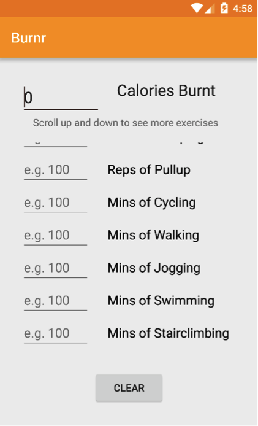

# PROG 01: Crunch Time

Burnr is a calorie converter that shows the user calories burnt doing different exercises. 

## Authors

Liang Wang ([helen.wang184@berkeley.edu](mailto:your_email@berkeley.edu))

## Demo Video

See [Burnr Demo] (https://vimeo.com/154363760)

## Screenshots

The startup screen	has 0 calories and 0 amount of exercise. 

User can start to enter the amount of calories they want to burn. Instantly, the repetitions or minutes of different exercises required will be updated.  	

User can scroll down to see more exercises. 

User can start typing next to any exercise. Instantly, the calories burnt and the amount of other exercises required for the same amount of calories will be updated. 

User can use the clear button to clear the calories and repetition/minutes.

Burnr also can be used in the horizontal orientation.

## Acknowledgments

* Hat tip to anyone who's code was used
* Any other support

*Feel free to enhance your README. For Markdown syntax, see [the GitHub Guides](https://guides.github.com/features/mastering-markdown/). Remove this line in your submission.*
